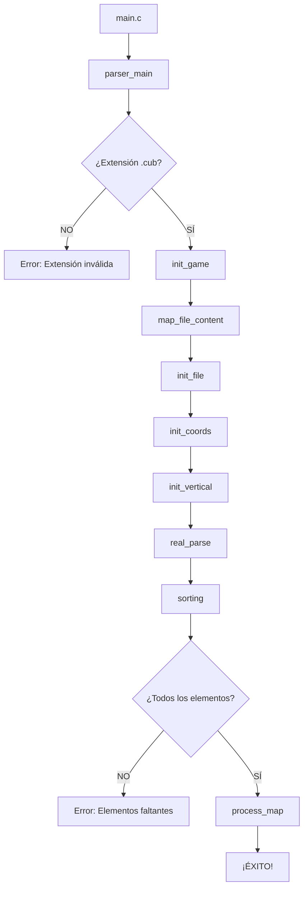

# CUB3D Parser Documentation 🎮

## Tabla de Contenidos
1. [Introducción](#introducción)
2. [Arquitectura General](#arquitectura-general)
3. [Estructuras de Datos](#estructuras-de-datos)
4. [Flujo de Ejecución](#flujo-de-ejecución)
5. [Análisis de Archivos](#análisis-de-archivos)
6. [Validaciones](#validaciones)
7. [Gestión de Errores](#gestión-de-errores)
8. [Problemas Identificados](#problemas-identificados)
9. [Guía para la Parte Ejecutora](#guía-para-la-parte-ejecutora)

## Introducción

Este proyecto implementa un **parser** para archivos `.cub` del proyecto **cub3D**, que es una recreación del famoso Wolfenstein 3D usando técnicas de ray-casting. El parser se encarga de:

- ✅ Validar el formato del archivo `.cub`
- ✅ Extraer texturas de paredes (Norte, Sur, Este, Oeste)
- ✅ Extraer colores del suelo y techo
- ✅ Procesar el mapa del laberinto
- ✅ Detectar errores de formato

## Arquitectura General

```
┌─────────────────────────────────────────────────────────────┐
│                      FLUJO DEL PARSER                      │
├─────────────────────────────────────────────────────────────┤
│  1. main.c          │ Punto de entrada del programa         │
│  2. 0_parser.c      │ Controlador principal del parsing     │
│  3. 3_gnl_to_file.c │ Lee el archivo .cub línea por línea   │
│  4. 1_init_game.c   │ Inicializa la estructura del juego    │
│  5. 2_init_file.c   │ Convierte el archivo en lista enlazada│
│  6. 4_init_coords.c │ Inicializa coordenadas de texturas    │
│  7. 6_init_vert.c   │ Inicializa estructuras de colores     │
│  8. 7_sorting.c     │ Procesa y valida elementos            │
│  9. 8_process_data.c│ Distingue tipos de datos              │
│ 10. 9_process_coords│ Procesa texturas                      │
│ 11. 10_process_vert │ Procesa colores                       │
└─────────────────────────────────────────────────────────────┘
```

## DISCLAIMER!! ⚠️

He preguntado a Claude AI cuáles de los errores de valgrind pueden ser ajenos a la MLX42. La respuesta ha sido:

```

Valgrind reporta 0 bytes "definitely lost" (es decir, no hay fugas categorizadas como definitivamente perdidas).
Hay 317,955 bytes en 3,106 bloques “still reachable”.
Tus grep previos muestran muchas trazas que pasan por mlx_load_png, mlx_init, mlx_loop, mlx_terminate (todas en tu ejecutable), lo cual significa que las asignaciones están asociadas a código que involucra MLX42 o sus dependencias.
¿Qué significa eso y qué es probablemente ajeno a MLX42?

Las entradas "still reachable" suelen ser inofensivas en bibliotecas de terceros: a menudo son estructuras/caches/objetos que la librería inicializa y deja hasta el final del proceso (se liberarían al exit), o recursos mantenidos por drivers/GLFW/OpenGL. Por tanto la mayoría (o casi todas) de esas ~318 KB "still reachable" pueden ser ajenas a un bug en tu código y en su lugar ser:
Memoria reservada por MLX42 (p. ej. estructuras internas, tablas, textos, caches) y/o por bibliotecas embebidas en MLX42 (lodepng, glad, glfw). MLX42 incluye lodepng, glad y usa glfw, así que es plausible.
Recursos retenidos por el controlador gráfico (OpenGL) o por GLFW/glad; valgrind a menudo muestra "still reachable" por esos.
Datos que tu programa carga (texturas PNG) y que no se liberaron explícitamente antes de exit — esto sería tu responsabilidad, pero seguiría apareciendo como "still reachable" en vez de "definitely lost" si el programa termina y sigue referenciándolos.
Qué NO parece indicar el log

No hay "definitely lost" (0 bytes). Eso es buena señal: no hay fugas claras y confirmadas por Valgrind dentro de las rutas que registró.
Por tanto no hay evidencia de fugas graves causadas por tu código o por MLX42 en la ejecución que generó ese log.
Acciones concretas y recomendaciones

Interpretación práctica:

La mayoría de los registros que muestran mlx_init, mlx_load_png, mlx_loop, etc. muy probablemente indican memoria retenida por MLX42 o sus dependencias (lodepng/glfw/glad/GL), o por recursos que no se liberaron explícitamente antes de terminar.
Dado que "definitely lost" = 0, no hay fugas confirmadas. No parece que exista un bug severo de leak en MLX42 ni en tu código en esta corrida.
Cómo confirmarlo (si quieres estar 100% seguro):

Extrae uno o dos backtraces completos clasificados como “still reachable” que muestren la cadena de llamadas y fíjate si el stack termina en funciones de lodepng/glfw/glad/libGL o en funciones de MLX42 que gestionan caches. Si terminan en librerías externas/GLFW, es externo.
Busca en el log entradas de bibliotecas: nombres como libglfw, libGL, lodepng, malloc/new inside those libs. Ejemplo:
grep -nE "lodepng|glfw|libGL|glad|png" valgrind.log
Ejecutar Valgrind con supresiones para GLFW/GL (valgrind puede generar falsos positivos para OpenGL drivers). MLX42 repo puede incluir una supresión; si no, puedes crear una.
Si quieres que lo investigue más:

Puedo extraer un par de trazas representativas "still reachable" desde valgrind.log y decir específicamente si terminan en MLX42 puro o en dependencias/driver. Dime si quieres que haga eso y lo saco aquí.
Resumen final (respuesta directa a tu pregunta)

¿Cuáles de estos errores pueden ser ajenos a la #file:MLX42? La gran mayoría: las ~318 KB "still reachable" probablemente provienen de MLX42 y/o de sus dependencias (lodepng, glad, GLFW y el controlador gráfico). Además, "still reachable" frecuentemente no es un problema real — es memoria retenida hasta el final por librerías/driver. No hay "definitely lost", por lo que no hay fugas claras atribuidas a MLX42 ni a tu código en este run.
```

## Estructuras de Datos

### 🏗️ Estructura Principal: `t_game`

```c
typedef struct s_game {
    char    *path;        // Ruta del archivo .cub
    t_file  *file;        // Lista enlazada del contenido del archivo
    t_coord *north;       // Textura pared Norte
    t_coord *south;       // Textura pared Sur  
    t_coord *east;        // Textura pared Este
    t_coord *west;        // Textura pared Oeste
    t_vert  *floor;       // Color del suelo
    t_vert  *ceil;        // Color del techo
} t_game;
```

### 📄 Estructura de Archivo: `t_file`

```c
typedef struct s_file {
    char           *line;     // Contenido de la línea
    char           *path;     // Ruta del archivo origen
    bool           space;     // TRUE si la línea está vacía/solo espacios
    struct s_file  *next;     // Siguiente línea (lista enlazada)
} t_file;
```

**Visualización de la lista enlazada:**
```
┌─────────────────┐    ┌─────────────────┐    ┌─────────────────┐
│ t_file          │───▶│ t_file          │───▶│ t_file          │
│ line: "NO ./..."│    │ line: "SO ./..."│    │ line: "WE ./..."│
│ space: FALSE    │    │ space: FALSE    │    │ space: FALSE    │
└─────────────────┘    └─────────────────┘    └─────────────────┘
```

### 🧭 Estructura de Coordenadas: `t_coord`

```c
typedef struct s_coord {
    char       id;           // 'N', 'S', 'E', 'W'
    char       *id_name;     // "NO", "SO", "EA", "WE"
    int        events;       // Contador de apariciones
    t_texture  *tex;         // Información de la textura
} t_coord;
```

### 🎨 Estructura de Colores: `t_vert`

```c
typedef struct s_vert {
    char id;        // 'F' (Floor) o 'C' (Ceiling)
    int  red;       // Valor rojo (0-255)
    int  green;     // Valor verde (0-255)  
    int  blue;      // Valor azul (0-255)
    int  events;    // Contador de apariciones
} t_vert;
```

## Flujo de Ejecución

### 📊 Diagrama de Flujo Principal



### 🔍 Análisis Detallado por Archivo

#### 1. `main.c` - Punto de Entrada
```c
int main(int argc, char **argv)
{
    t_game *game;
    
    game = parser_main(argv[1], argc);  // Inicia el parsing
    if (!game)
        return (1);                     // Error en parsing
    ft_printf("YOU CAN PLAY!\n");       // Éxito
    free_game(game);                    // Libera memoria
    return (0);
}
```

**Función:** Controla el flujo principal y maneja el resultado del parsing.

#### 2. `0_parser.c` - Controlador Principal

```c
t_game *parser_main(char *argv, int argc)
{
    // 1. Valida argumentos
    if (argc != 2) return NULL;
    
    // 2. Valida extensión .cub
    if (cub_extension(argv) == FALSE) return NULL;
    
    // 3. Inicializa estructura del juego
    game = init_game(argv);
    
    // 4. Ejecuta parsing principal
    if (real_parse(game) == FALSE) return NULL;
    
    return game;
}
```

**Validación de Extensión:**
```c
static int cub_extension(char *str)
{
    // Busca ".cub" al final del nombre
    // Ejemplo: "map.cub" ✅ | "map.txt" ❌
}
```

#### 3. `3_gnl_to_file.c` - Lectura de Archivo

```c
char **map_file_content(char *str)
{
    // 1. Abre el archivo
    fd = open(str, O_RDONLY);
    
    // 2. Cuenta las líneas
    file_dimensions(fd);
    
    // 3. Reserva memoria
    file = malloc(...);
    
    // 4. Lee línea por línea con get_next_line
    file_content(file, fd);
    
    return file;
}
```

**Gestión de Archivos Vacíos:**
```c
if (!file || !file[0]) {
    print_error(EEMPTYFILE);
    return NULL;
}
```

#### 4. `2_init_file.c` - Lista Enlazada

Convierte el array de strings en una lista enlazada para facilitar el procesamiento:

```c
t_file *init_file(char **content, char *path)
{
    // Para cada línea del archivo:
    while (content[index]) {
        // 1. Crea nuevo nodo
        temp = new_file_node(content[index], path);
        
        // 2. Detecta si es línea vacía
        file->space = is_space_array(line);
        
        // 3. Enlaza al final de la lista
        join_to_structure(&file, temp);
    }
}
```

#### 5. `4_init_coordinates.c` - Inicialización de Texturas

```c
int init_coords(t_game *game)
{
    // Inicializa las 4 direcciones
    game->north = new_coord_node(game, "NO");
    game->south = new_coord_node(game, "SO");  
    game->east  = new_coord_node(game, "EA");
    game->west  = new_coord_node(game, "WE");
}
```

**Estado Inicial:**
```
NO: { id: 'N', id_name: "NO", events: 0, tex: NULL }
SO: { id: 'S', id_name: "SO", events: 0, tex: NULL }
EA: { id: 'E', id_name: "EA", events: 0, tex: NULL }
WE: { id: 'W', id_name: "WE", events: 0, tex: NULL }
```

#### 6. `7_sorting.c` - Procesamiento Principal

```c
int sorting(t_game *game)
{
    lines = 6;  // Esperamos exactamente 6 elementos
    temp = game->file;
    
    // Procesa primeras 6 líneas no vacías
    while (temp && lines > 0) {
        if (temp->space == FALSE) {
            process_data(game, temp->line);
            lines--;
        }
        temp = temp->next;
    }
    
    // Valida que todos los elementos estén presentes
    if (missing_elements()) return FALSE;
    
    // Procesa el mapa
    process_map(game, temp);
}
```

#### 7. `8_process_data.c` - Clasificación de Datos

```c
int process_data(t_game *game, char *line)
{
    splited = u_split(line);  // Divide por espacios
    
    if (array_length(splited) == 2) {
        if (splited[0][0] == 'F' || splited[0][0] == 'C') {
            // Es un color: "F 220,100,0"
            process_vertical(game, splited);
        } else {
            // Es una textura: "NO ./path.xpm"
            process_coordinates(game, splited);
        }
    }
}
```

**Ejemplos de Procesamiento:**
```
Input: "NO ./north.xpm"     → process_coordinates()
Input: "F 220,100,0"        → process_vertical()
Input: "111111"             → process_map()
```

#### 8. `9_process_coordinates.c` - Procesamiento de Texturas

```c
int process_coordinates(t_game *game, char **line)
{
    // Identifica el tipo de coordenada
    if (is_coord(line[0]) == N_NBR)
        return process_tex(game->north, line[1]);
    else if (is_coord(line[0]) == S_NBR)
        return process_tex(game->south, line[1]);
    // ...
}
```

**Validación de Texturas:**
```c
static int process_tex(t_coord *coord, char *line)
{
    // 1. Verifica que no esté duplicado
    if (coord->tex) return ERROR;
    
    // 2. Valida formato de ruta
    if (line[0] != '.' || line[1] != '/') return ERROR;
    
    // 3. Guarda la textura
    coord->tex->tex = ft_strdup(line);
}
```

#### 9. `10_process_vertical.c` - Procesamiento de Colores

```c
int process_vertical(t_game *game, char **line)
{
    // Determina si es Floor o Ceiling
    if (is_vert(line[0]) == F_NBR)
        return fill_color_values(game->floor, line);
    else if (is_vert(line[0]) == C_NBR)
        return fill_color_values(game->ceil, line);
}
```

**Procesamiento de Colores:**
```c
static int fill_color_values(t_vert *vert, char **line)
{
    // 1. Verifica duplicados
    if (vert->red != -1) return ERROR;
    
    // 2. Divide por comas: "220,100,0" → ["220", "100", "0"]
    color_parts = ft_split(line[1], ',');
    
    // 3. Convierte a enteros y valida rango 0-255
    vert->red   = ft_atoi(color_parts[0]);
    vert->green = ft_atoi(color_parts[1]);
    vert->blue  = ft_atoi(color_parts[2]);
}
```

## Validaciones

### ✅ Validaciones Implementadas

1. **Extensión de Archivo**
   ```
   ✅ archivo.cub
   ❌ archivo.txt
   ❌ archivo.cu
   ```

2. **Elementos Obligatorios**
   ```
   ✅ NO, SO, EA, WE (texturas)
   ✅ F, C (colores)
   ```

3. **Formato de Colores**
   ```
   ✅ F 220,100,0
   ❌ F 220 100 0
   ❌ F 256,100,0 (fuera de rango)
   ```

4. **Rutas de Texturas**
   ```
   ✅ NO ./path/texture.xpm
   ❌ NO path/texture.xpm (sin ./)
   ```

### ❌ Validaciones Pendientes (Problemas Identificados)

1. **Archivo Vacío**
   - **Problema:** No detecta correctamente archivos completamente vacíos
   - **Test que falla:** `map_1.cub` (archivo vacío)

2. **Elementos Duplicados**
   - **Problema:** Permite duplicados en algunos casos
   - **Test que falla:** `map_2.cub` (tiene "NO" duplicado)

3. **Posición del Mapa**
   - **Problema:** No valida que el mapa sea el último elemento
   - **Test que falla:** `map_3.cub` (mapa antes de texturas)

## Gestión de Errores

### 🚨 Sistema de Errores

```c
// Definiciones de errores (en header)
#define EEMPTYFILE "The .cub file is empty."
#define ECUB "File must have .cub extension"
#define EMISSINGELEM "Missing or duplicated element identifier."
#define ECOLFORMAT "Invalid color format"
```

### 📋 Matriz de Errores por Test

| Test | Error Esperado | Error Actual | Estado |
|------|---------------|--------------|--------|
| map_0.cub | ✅ Success | ✅ Success | ✅ OK |
| map_1.cub | "Empty file" | No detecta | ❌ FAIL |
| map_2.cub | "Duplicated element" | No detecta | ❌ FAIL |
| map_3.cub | "Map position" | No detecta | ❌ FAIL |

## Problemas Identificados

### 🐛 Bug #1: Detección de Archivo Vacío

**Ubicación:** `0_parser.c` - `real_parse()`

**Problema:**
```c
// Código actual - PROBLEMÁTICO
temp = game->file;
while (temp && (!temp->line || !temp->line[0] || temp->space == TRUE))
    temp = temp->next;

if (!temp)
    return (print_error(EEMPTYFILE));
```

**Solución:**
```c
// Verificación más robusta
if (!game->file || !game->file->line) {
    return (print_error(EEMPTYFILE));
}

// Verificar si solo hay líneas vacías
t_file *temp = game->file;
int has_content = FALSE;
while (temp) {
    if (temp->line && temp->line[0] && temp->space == FALSE) {
        has_content = TRUE;
        break;
    }
    temp = temp->next;
}

if (!has_content) {
    return (print_error(EEMPTYFILE));
}
```

### 🐛 Bug #2: Detección de Duplicados

**Ubicación:** `9_process_coordinates.c` y `10_process_vertical.c`

**Problema:** Solo detecta duplicados cuando la estructura ya tiene valor, pero no detecta múltiples líneas con el mismo identificador.

**Ejemplo problemático:**
```
NO ./texture1.xpm
NO ./texture2.xpm  ← Segundo NO no detectado como error
```

**Solución:** Implementar contador de apariciones y validar antes de procesar.

### 🐛 Bug #3: Validación de Posición del Mapa

**Ubicación:** `7_sorting.c`

**Problema:** No valida que el mapa esté al final del archivo.

**Archivo problemático (map_3.cub):**
```
1011000001110000000000001  ← MAPA AL INICIO
        1001000000000000000000001
111111111011000001110000000000001

NO ./path_to_north_texture.xpm  ← TEXTURAS DESPUÉS
SO ./path_to_south_texture.xpm
```

**Solución:** Implementar validación de orden de elementos.

## Guía para la Parte Ejecutora

### 🎯 Interfaz para el Rendering Engine

Una vez que el parser termine exitosamente, la estructura `t_game` contendrá:

#### Texturas Disponibles:
```c
game->north->tex->tex  // "./path_to_north_texture.xpm"
game->south->tex->tex  // "./path_to_south_texture.xpm"
game->east->tex->tex   // "./path_to_east_texture.xpm"
game->west->tex->tex   // "./path_to_west_texture.xpm"
```

#### Colores Disponibles:
```c
// Suelo
game->floor->red    // 0-255
game->floor->green  // 0-255
game->floor->blue   // 0-255

// Techo
game->ceil->red     // 0-255
game->ceil->green   // 0-255
game->ceil->blue    // 0-255
```

#### Acceso al Mapa:
```c
// El mapa estará en la lista enlazada después de los 6 elementos
t_file *map_start = /* posición después de texturas y colores */;
while (map_start) {
    if (map_start->space == FALSE) {
        // Esta línea contiene datos del mapa
        char *map_line = map_start->line;
        // Procesar: '0'=espacio, '1'=pared, 'N/S/E/W'=jugador
    }
    map_start = map_start->next;
}
```

### 🔧 Funciones de Utilidad Necesarias

Para el rendering engine, necesitarás implementar:

1. **Extractor de Mapa:**
   ```c
   char **extract_map_array(t_game *game);
   ```

2. **Detector de Posición del Jugador:**
   ```c
   t_player_pos find_player_position(t_game *game);
   ```

3. **Validador de Mapa:**
   ```c
   int validate_map_walls(char **map);
   int validate_single_player(char **map);
   ```

### 📐 Coordenadas del Juego

```
Sistema de Coordenadas:
   N (Norte)
   ↑
W ←┼→ E (Este)
   ↓
   S (Sur)

Identificadores de Pared:
- NO: Textura para pared Norte
- SO: Textura para pared Sur  
- EA: Textura para pared Este
- WE: Textura para pared Oeste
```

### 🎮 Controles Esperados (según subject)

```c
// Teclas de movimiento
W, A, S, D  // Mover jugador
←, →        // Rotar cámara
ESC         // Salir del juego
```

### 📝 Checklist para la Implementación

- [ ] Extraer mapa como array 2D
- [ ] Encontrar posición inicial del jugador
- [ ] Validar que el mapa esté cerrado por paredes
- [ ] Cargar texturas con miniLibX
- [ ] Implementar ray-casting
- [ ] Gestionar eventos de teclado
- [ ] Renderizar frame por frame

### 🚀 Próximos Pasos

1. **Corregir bugs del parser** (ver sección Problemas Identificados)
2. **Implementar extracción del mapa**
3. **Crear interfaz para el rendering engine**
4. **Documentar API entre parser y renderer**

---

## Conclusión

El parser actual maneja correctamente los casos básicos pero necesita correcciones para pasar todos los tests. Los problemas principales están en la detección de archivos vacíos, elementos duplicados y validación del orden de elementos.

Una vez corregidos estos issues, el parser proporcionará una base sólida para el rendering engine del cub3D.

**Estado del Proyecto:** 🟡 Funcional con bugs menores
**Tests Pasados:** 1/4  
**Próxima Fase:** Debugging + Implementación del Renderer

---

*Documentación generada para el proyecto cub3D - 42 School*